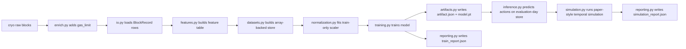

# Architecture Guide

This document is the deep-dive guide to the `spice-temporal-baseline` codebase. It explains the current architecture, the data and math contracts, how the modules fit together, and what invariants the implementation relies on.

The scope of this repository is the **temporal module only** from the SPICE paper:

- per-chain temporal fee forecasting
- bounded-delay execution selection
- offline training on pre-evaluation history
- evaluation-day temporal simulation

It explicitly does **not** implement:

- the spatial module
- oracle committees / reputation / producer coordination
- multi-chain coordination logic beyond running the same temporal workflow per chain

## Design Principles

The codebase is structured around a few explicit constraints.

- Raw data, enrichment, offline datasets, training, and simulation are separate stages.
- Time semantics are fixed from config. There is no runtime calibration or adaptive timing.
- The runtime dataset core is array-backed and lazy-sliced. It does not materialize Python example objects.
- Economic metrics use aggregate totals, not mean event-level percentages.
- There are no legacy aliases or old/new dual paths.

Those choices are deliberate. They keep the repository coherent and make it feasible to scale toward the paper’s `~400k` anchor regime.

## High-Level Flow

The project runs in five stages.

1. Pull raw block data with `cryo`.
2. Enrich block rows with `gas_limit` because `cryo blocks` does not provide it in the schema used here.
3. Build an offline temporal dataset from enriched block rows.
4. Train a temporal model and persist a canonical artifact directory.
5. Load the artifact and run the paper-style evaluation-day simulation.

At a high level, the flow is:

## Repository Structure

### Root

- [README.md](/Users/edo/Documents/Obsidian/the-vault/university/Thesis/spice-temporal-baseline/README.md): short usage and workflow summary
- [ARCHITECTURE.md](/Users/edo/Documents/Obsidian/the-vault/university/Thesis/spice-temporal-baseline/ARCHITECTURE.md): this document
- [pyproject.toml](/Users/edo/Documents/Obsidian/the-vault/university/Thesis/spice-temporal-baseline/pyproject.toml): project metadata and dev dependencies
- [pyrightconfig.json](/Users/edo/Documents/Obsidian/the-vault/university/Thesis/spice-temporal-baseline/pyrightconfig.json): typechecking configuration
- [configs/](/Users/edo/Documents/Obsidian/the-vault/university/Thesis/spice-temporal-baseline/configs): baseline and pilot YAML configs
- [src/spice_temporal/](/Users/edo/Documents/Obsidian/the-vault/university/Thesis/spice-temporal-baseline/src/spice_temporal): implementation
- [tests/](/Users/edo/Documents/Obsidian/the-vault/university/Thesis/spice-temporal-baseline/tests): unit and smoke tests

### Core Modules

- [config.py](/Users/edo/Documents/Obsidian/the-vault/university/Thesis/spice-temporal-baseline/src/spice_temporal/config.py)
- [env.py](/Users/edo/Documents/Obsidian/the-vault/university/Thesis/spice-temporal-baseline/src/spice_temporal/env.py)
- [cryo.py](/Users/edo/Documents/Obsidian/the-vault/university/Thesis/spice-temporal-baseline/src/spice_temporal/cryo.py)
- [rpc.py](/Users/edo/Documents/Obsidian/the-vault/university/Thesis/spice-temporal-baseline/src/spice_temporal/rpc.py)
- [io.py](/Users/edo/Documents/Obsidian/the-vault/university/Thesis/spice-temporal-baseline/src/spice_temporal/io.py)
- [enrich.py](/Users/edo/Documents/Obsidian/the-vault/university/Thesis/spice-temporal-baseline/src/spice_temporal/enrich.py)
- [records.py](/Users/edo/Documents/Obsidian/the-vault/university/Thesis/spice-temporal-baseline/src/spice_temporal/records.py)
- [features.py](/Users/edo/Documents/Obsidian/the-vault/university/Thesis/spice-temporal-baseline/src/spice_temporal/features.py)
- [datasets.py](/Users/edo/Documents/Obsidian/the-vault/university/Thesis/spice-temporal-baseline/src/spice_temporal/datasets.py)
- [normalization.py](/Users/edo/Documents/Obsidian/the-vault/university/Thesis/spice-temporal-baseline/src/spice_temporal/normalization.py)
- [torch_datasets.py](/Users/edo/Documents/Obsidian/the-vault/university/Thesis/spice-temporal-baseline/src/spice_temporal/torch_datasets.py)
- [models.py](/Users/edo/Documents/Obsidian/the-vault/university/Thesis/spice-temporal-baseline/src/spice_temporal/models.py)
- [evaluation.py](/Users/edo/Documents/Obsidian/the-vault/university/Thesis/spice-temporal-baseline/src/spice_temporal/evaluation.py)
- [training.py](/Users/edo/Documents/Obsidian/the-vault/university/Thesis/spice-temporal-baseline/src/spice_temporal/training.py)
- [pipeline.py](/Users/edo/Documents/Obsidian/the-vault/university/Thesis/spice-temporal-baseline/src/spice_temporal/pipeline.py)
- [inference.py](/Users/edo/Documents/Obsidian/the-vault/university/Thesis/spice-temporal-baseline/src/spice_temporal/inference.py)
- [simulation.py](/Users/edo/Documents/Obsidian/the-vault/university/Thesis/spice-temporal-baseline/src/spice_temporal/simulation.py)
- [artifacts.py](/Users/edo/Documents/Obsidian/the-vault/university/Thesis/spice-temporal-baseline/src/spice_temporal/artifacts.py)
- [reporting.py](/Users/edo/Documents/Obsidian/the-vault/university/Thesis/spice-temporal-baseline/src/spice_temporal/reporting.py)
- [cli.py](/Users/edo/Documents/Obsidian/the-vault/university/Thesis/spice-temporal-baseline/src/spice_temporal/cli.py)

## Configuration Model

The entire runtime contract starts with [config.py](/Users/edo/Documents/Obsidian/the-vault/university/Thesis/spice-temporal-baseline/src/spice_temporal/config.py).

Important config types:

- `ChainConfig`
- `PullConfig`
- `SplitConfig`
- `TrainingConfig`
- `SimulationConfig`
- `ModelConfig`
- `ExperimentConfig`

The most important research-facing fields are:

- `chains[].block_time_seconds`
- `max_delay_seconds`
- `lookback_seconds`
- `target_anchor_count`

The implementation assumes these are the authoritative timing semantics. There is no data-dependent recomputation of horizons.

Current defaults match the intended temporal setup:

- Ethereum: `12.0`
- Polygon: `2.0`
- Avalanche: `1.6`

## Data Ingestion and Enrichment

### Raw Pulls

[cryo.py](/Users/edo/Documents/Obsidian/the-vault/university/Thesis/spice-temporal-baseline/src/spice_temporal/cryo.py) builds and runs `cryo` commands for history and evaluation-day pulls.

This module does one thing only:

- plan and execute raw block downloads

It does **not** modify the pulled schema and does **not** hide extra RPC hydration.

### Why Enrichment Exists

The project needs `gas_limit` to compute gas utilization:

`gas_utilization = gas_used / gas_limit`

The `blocks` data we pull via `cryo` does not include `gas_limit` in the current setup, so [enrich.py](/Users/edo/Documents/Obsidian/the-vault/university/Thesis/spice-temporal-baseline/src/spice_temporal/enrich.py) is a dedicated second stage that fills only that missing field.

This separation matters:

- raw data remains reproducible
- enrichment is deterministic and rerunnable
- loaders stay offline and pure
- network IO stays out of the training/inference path

If `cryo` later exposes `gas_limit` directly in the block schema, `enrich.py` should be deleted rather than bypassed piecemeal.

### Loading

[io.py](/Users/edo/Documents/Obsidian/the-vault/university/Thesis/spice-temporal-baseline/src/spice_temporal/io.py) loads files or directories of JSON/CSV/Parquet block data and normalizes them into `BlockRecord`.

[records.py](/Users/edo/Documents/Obsidian/the-vault/university/Thesis/spice-temporal-baseline/src/spice_temporal/records.py) intentionally contains only `BlockRecord`. The earlier example-level record types were removed because they did not scale cleanly.

## Temporal Semantics

This is the most important conceptual contract in the repository.

The temporal model does **not** predict an absolute timestamp. It chooses a discrete action under a bounded extra-wait budget.

Action semantics:

- action `0`: execute at the next block
- action `k`: wait `k` extra blocks beyond the next-block baseline

The math lives in [datasets.py](/Users/edo/Documents/Obsidian/the-vault/university/Thesis/spice-temporal-baseline/src/spice_temporal/datasets.py).

Definitions:

- `lookback_steps = round(lookback_seconds / block_time_seconds)`
- `max_extra_wait_steps = max(1, floor(max_delay_seconds / block_time_seconds))`
- `action_count = max_extra_wait_steps + 1`

Examples:

- Ethereum `12s`: `max_extra_wait_steps = 1`, `action_count = 2`
- Ethereum `24s`: `2`, `3`
- Ethereum `36s`: `3`, `4`
- Polygon `36s`: `18`, `19`
- Avalanche `36s`: `22`, `23`

This is why Ethereum `12s` remains binary and still fits the broader paper framing.

## Feature Engineering

[features.py](/Users/edo/Documents/Obsidian/the-vault/university/Thesis/spice-temporal-baseline/src/spice_temporal/features.py) builds one dense feature row per usable block after warmup.

It produces a `FeatureTable`:

- `block_numbers`
- `timestamps`
- `feature_matrix`
- `log_base_fees`

Important feature behavior:

- rows are ordered by `block_number`
- the warmup is `200 - 1 = 199` blocks
- the target fee uses `log(base_fee_per_gas)`
- `elapsed_blocks` is the index inside the trimmed dataset, not the global chain height

Feature set:

- `log_base_fee`
- `gas_utilization`
- hour-of-day cyclical encoding
- weekday cyclical encoding
- `elapsed_blocks`
- `trend_slope_200` via OLS slope on trailing `200` log fees
- rolling mean/std over `10/50/200` blocks for:
  - log base fee
  - gas utilization

This module only builds **row-local features**. It does not define anchor samples or train/validation/test splits.

## Dataset Core

[datasets.py](/Users/edo/Documents/Obsidian/the-vault/university/Thesis/spice-temporal-baseline/src/spice_temporal/datasets.py) owns:

- temporal geometry
- tail trimming
- shared array-backed dataset construction
- chronological split indices
- evaluation-window sample filtering

### Geometry

`DatasetGeometry` stores:

- `lookback_steps`
- `max_extra_wait_steps`
- `action_count`
- `feature_warmup_blocks`
- `context_block_count`

`context_block_count = warmup + lookback_steps - 1`

That is the amount of history needed to build valid evaluation-day windows.

### Shared Store

`TemporalDatasetStore` is the runtime dataset core.

It contains:

- `feature_matrix: float32[n_rows, n_features]`
- `block_numbers: int64[n_rows]`
- `timestamps: int64[n_rows]`
- `anchor_row_indices: int64[n_samples]`
- `class_labels: int64[n_samples]`
- `action_log_fees: float32[n_samples, action_count]`
- `target_log_fee: float32[n_samples]`
- `next_block_log_fee: float32[n_samples]`
- `optimal_log_fee: float32[n_samples]`

This design matters because it avoids materializing one Python object per sample with copied nested window lists. The sequence windows are sliced lazily later in the PyTorch dataset adapter.

### Anchor Construction

For each anchor row:

- input window = trailing `lookback_steps` feature rows ending at the anchor row
- action candidates = next `action_count` future log fees
- `class_label` = earliest minimum among those action fees
- `target_log_fee` = fee at the chosen action
- `next_block_log_fee` = fee for action `0`
- `optimal_log_fee` = minimum fee among all candidate actions

### Splits

Train/validation/test are chronological, not shuffled.

The split output is `DatasetSplitIndices`, not copied subsets of the store.

## Normalization

[normalization.py](/Users/edo/Documents/Obsidian/the-vault/university/Thesis/spice-temporal-baseline/src/spice_temporal/normalization.py) implements train-only feature scaling.

The key subtlety is that windows overlap. A naive scaler over unique feature rows would not match the actual training exposure, because rows near the middle of the dataset appear in more windows than edge rows.

The scaler therefore computes exact row multiplicities induced by the train anchor set:

- each training anchor contributes `+1` to every row in its lookback window
- a difference-array / prefix-sum method turns that into per-row counts
- means and variances are then computed as weighted row statistics

This gives the same result as expanding all training windows and flattening them, but without building that huge expanded matrix.

`StandardScaler` stores:

- `means`
- `stds`

The scaled feature matrix is applied once to the shared store and then reused by all split/index views.

## PyTorch Data Layer

[torch_datasets.py](/Users/edo/Documents/Obsidian/the-vault/university/Thesis/spice-temporal-baseline/src/spice_temporal/torch_datasets.py) contains the bridge from the shared dataset store into PyTorch.

`SequenceDataset`:

- holds one `TemporalDatasetStore`
- holds one set of sample indices
- slices each lookback window lazily in `__getitem__`

Batch contract:

- `inputs`
- `class_label`
- `target_log_fee`
- `action_log_fees`
- `next_block_log_fee`
- `optimal_log_fee`

### Class Weights

`build_class_weights(...)` now uses plain inverse frequency from the **training split only**:

- `weight[c] = 1 / count[c]`

There is:

- no clipping
- no renormalization
- no smoothing

If any action class is absent from the training split, the function fails fast. That is intentional, because the class space would be under-specified for that run.

## Models

[models.py](/Users/edo/Documents/Obsidian/the-vault/university/Thesis/spice-temporal-baseline/src/spice_temporal/models.py) defines the three baseline families:

- `LSTMBaseline`
- `TransformerBaseline`
- `TransformerLSTMBaseline`

All models share the same output contract:

- classifier head -> logits over `action_count`
- regression head -> predicted log fee

The output type is `ModelOutputs` from [contracts.py](/Users/edo/Documents/Obsidian/the-vault/university/Thesis/spice-temporal-baseline/src/spice_temporal/contracts.py).

That shared contract is what allows training, inference, artifact loading, and simulation to stay generic.

## Training and Evaluation Math

[training.py](/Users/edo/Documents/Obsidian/the-vault/university/Thesis/spice-temporal-baseline/src/spice_temporal/training.py) owns:

- device resolution
- microbatch selection
- training loop
- early stopping
- validation loop
- test evaluation

### Loss

Per batch:

- `block_loss = weighted CrossEntropy(logits, class_labels)`
- `fee_loss = SmoothL1(fee_hat, target_log_fee)`
- `total_loss = alpha * block_loss + beta * fee_loss`

### Metric Aggregation

This code now uses **ratio-of-sums** economics, not mean-of-ratios.

For a batch or epoch:

- `realized_fee_sum`
- `baseline_fee_sum`
- `optimal_fee_sum`

Then:

- `profit_over_baseline = (baseline_fee_sum - realized_fee_sum) / baseline_fee_sum`
- `cost_over_optimum = (realized_fee_sum - optimal_fee_sum) / optimal_fee_sum`

Accuracy is standard:

- `correct_count / total_count`

Loss is aggregated as:

- `total_loss_sum / total_count`

This is the right choice for aggregate temporal-cost reporting.

[evaluation.py](/Users/edo/Documents/Obsidian/the-vault/university/Thesis/spice-temporal-baseline/src/spice_temporal/evaluation.py) contains the low-level batch metric logic used by training and test evaluation.

## Pipeline Orchestration

[pipeline.py](/Users/edo/Documents/Obsidian/the-vault/university/Thesis/spice-temporal-baseline/src/spice_temporal/pipeline.py) is the orchestration layer between raw records and model training/inference.

### Training Preparation

`prepare_training_dataset(...)`:

1. derive geometry from config
2. trim the raw history tail to the exact block count needed for `target_anchor_count`
3. build the feature table
4. build the temporal dataset store
5. split chronologically
6. fit the scaler on the training split only
7. scale the store feature matrix once

### Inference Preparation

`prepare_inference_dataset(...)`:

1. pull the exact history context tail needed for evaluation
2. concatenate history context + evaluation-day blocks
3. build the feature table
4. build the temporal dataset store
5. keep only anchors whose timestamps fall inside the evaluation-day window
6. apply the training-fitted scaler

### Training Entry Point

`run_training(...)`:

1. load blocks from disk
2. prepare the training dataset
3. build the model
4. train
5. evaluate on the held-out test split

## Inference

[inference.py](/Users/edo/Documents/Obsidian/the-vault/university/Thesis/spice-temporal-baseline/src/spice_temporal/inference.py) runs batched forward passes over a `TemporalDatasetStore` plus sample-index view.

It returns predicted action offsets for each inference sample.

This is intentionally separate from simulation:

- inference = model outputs
- simulation = economic event sampling and scoring

## Simulation

[simulation.py](/Users/edo/Documents/Obsidian/the-vault/university/Thesis/spice-temporal-baseline/src/spice_temporal/simulation.py) implements the paper-style evaluation-day temporal simulation.

### Inputs

- one scaled evaluation-day `TemporalDatasetStore`
- predicted action offsets
- selected evaluation sample indices
- simulation config:
  - `window_seconds`
  - `arrival_rate_per_second`
  - `repetitions`
  - `seed`

### Simulation Steps

For each repetition:

1. choose a random window start uniformly from the valid evaluation range
2. sample Poisson arrivals in that window
3. map each arrival to the latest anchor available at or before that time
4. evaluate:
   - model realized fee
   - next-block baseline fee
   - optimum fee within the available action set
5. aggregate absolute totals for the run
6. convert those totals to run-level percentages

Per run:

- `profit_over_baseline = (baseline_total - model_total) / baseline_total`
- `cost_over_optimum = (model_total - optimum_total) / optimum_total`
- `baseline_cost_over_optimum = (baseline_total - optimum_total) / optimum_total`

Then the final summary is mean/std across runs.

This is intentionally different from averaging per-event percentages.

## Artifacts and Reporting

[artifacts.py](/Users/edo/Documents/Obsidian/the-vault/university/Thesis/spice-temporal-baseline/src/spice_temporal/artifacts.py) defines the canonical persisted artifact directory:

- `artifact.json`
- `model.pt`
- `train_report.json`
- `simulation_report.json`

The manifest stores:

- chain config
- temporal geometry
- model config
- scaler
- feature names

[reporting.py](/Users/edo/Documents/Obsidian/the-vault/university/Thesis/spice-temporal-baseline/src/spice_temporal/reporting.py) converts internal runtime structures into stable JSON reports.

Important report fields:

- `max_extra_wait_steps`
- `action_count`
- train/validation/test sizes
- aggregate economic metrics

Those are the fields to inspect when comparing experiment runs.

## CLI Surface

[cli.py](/Users/edo/Documents/Obsidian/the-vault/university/Thesis/spice-temporal-baseline/src/spice_temporal/cli.py) is the public operational interface.

Commands:

- `show-config`
- `plan-pull`
- `pull-blocks`
- `enrich-blocks`
- `train`
- `simulate`

There is no alternative legacy CLI path. `train` is the one canonical training command and `simulate` is the one canonical paper-comparison command.

## Testing Strategy

The test suite in [tests/](/Users/edo/Documents/Obsidian/the-vault/university/Thesis/spice-temporal-baseline/tests) is structured around the core invariants:

- config loading
- raw/enriched IO
- dataset geometry
- exact weighted-scaler math
- lazy sequence slicing
- inverse-frequency class weights
- training/evaluation aggregation
- artifact roundtrip
- CLI smoke flow for `train` and `simulate`

The verification bar is:

- `PYTHONPATH=src .venv/bin/python -m ruff check src tests`
- `PYTHONPATH=src .venv/bin/python -m pyright src/spice_temporal`
- `PYTHONPATH=src .venv/bin/python -m pytest -q`

## Current Invariants

These are the most important invariants to preserve when modifying the codebase.

- `block_time_seconds` is fixed from config, never inferred at runtime.
- `action_count = max_extra_wait_steps + 1`.
- action `0` always means next-block execution.
- training normalization is fit from the training split only.
- runtime datasets are array-backed, not per-example Python object collections.
- economic metrics are aggregate ratio-of-sums metrics.
- `enrich.py` is the only place where gas-limit hydration occurs.
- raw data loading and model training stay offline once enriched data exists.

## Extension Guidance

If you extend the repository, prefer the following.

- Add new model families in [models.py](/Users/edo/Documents/Obsidian/the-vault/university/Thesis/spice-temporal-baseline/src/spice_temporal/models.py) without changing the `ModelOutputs` contract.
- Add new report fields in [reporting.py](/Users/edo/Documents/Obsidian/the-vault/university/Thesis/spice-temporal-baseline/src/spice_temporal/reporting.py), not ad hoc print-only output.
- Keep new dataset logic inside the shared store/index model in [datasets.py](/Users/edo/Documents/Obsidian/the-vault/university/Thesis/spice-temporal-baseline/src/spice_temporal/datasets.py).
- Keep runtime network access out of loaders and training paths.

If a future change would require:

- adaptive timing
- alternate action semantics
- hidden network IO during loading
- reintroducing per-example runtime objects

that should be treated as an architectural regression unless there is a very strong reason to accept it.
